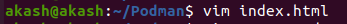
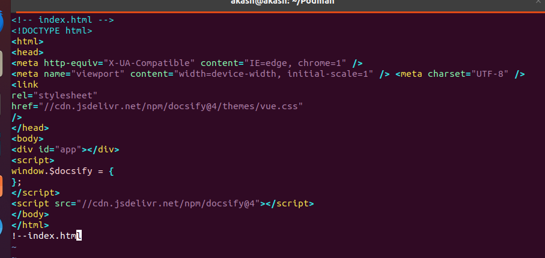

# Docsify setup in podman 

**Requirement of docsify setup:**

Docsify is a lightweight, flexible, and easy-to-set-up documentation generator that can turn your Markdown documentation into a website.

- Distributor ID: Ubuntu <br>
- Description: Ubuntu 20.04.6 LTS <br>
- Release: 20.04 <br>
- Codename: focal<br>

**Prerequisites tools:**
 
 - Podman 

   

**Podman**

- Podman is a tool that helps you run and manage software packages called containers on your computer.

**Github**

- GitHub is an online software development platform. It's used for storing, tracking, and collaborating on software projects.
 
<br>  
Now start a setup by following these steps:
<br>

**Step 1: Update Your System**

First update and upgrade by using this command :
```
sudo apt update 
sudo apt upgrade
  ```

Then use podman installation command:


**Step 2: Install Podman**
```bash
sudo apt-get install -y podman
```
- sudo : Superuser do

- apt : This stands for "Advanced Package Tool. apt is used to install, update, and manage software packages on your sysytem.

- -y : Automatically confirms the installation without asking for user input.

- podman : It is the name of the package you want to install.

**Step 3: Check Podman Version**


**Step 4: Create a Directory**

```bash
mkdir Podman
```
- mkdir : This command use for making a new directory
- docs : Name of new directory.


**Step-5:- Create Dockerfile**

Add details in Dockerfile:
```bash
sudo apt install vim

```


```bash
vim Dockerfile
```


- vim : Use for create and edit a file.

- Dockerfile : Name of file.

Add details in Dockerfile:

please insert button and than


``` bash 
FROM node:latest
LABEL description="A demo Dockerfile for build Docsify."
WORKDIR /docs
RUN npm install -g docsify-cli@latest
EXPOSE 3000/tcp
ENTRYPOINT docsify serve .
  ```

save this file
1) esc
2) :
3) wq
4) enter button


**Step-6:-Create index.html**


please insert button and than


```bash
vim index.html
```



save this file
1) esc
2) :
3) wq
4) enter button



Add details in html file:

**Step-7:- Create new file in md format**

```bash
touch README.md
```
- touch : Use for creating new file.
  
Here we can check all files by using this command:

- ls : It is a Linux shell command that lists directory contents of files and directories.


  
**Step-8:- Build docker image**

```bash 
sudo apt  install docker.io
 ```
 

```bash 
 podman build -f Dockerfile -t docsify/demo .
 ```


- podman build : Initiating the container image building process means starting the procedure to create a new container image.

- -f : It stands for file.

- Dockerfile : It specifies the name of the Dockerfile that should be used for the container image build.

- -t : It stands for tag.

- docsify : This is the name for the image.

- / : It uses for path separator in file and directory path.

- demo : This is the tag for the image.

This command is used to manage container images in Podman.

**Step-9:-Run podman**

Create a podman container for docsify.

```bashcd
 podman run -d -p 3000:3000 -v /home/tripathi/docsify1:/docs localhost/docsify/demo
```


This command will run a container based on the docsify/demo image.

- Podman run : It is used to run a container from the docsify/demo image.

- -d (detach mode): It allows the container to run in the background. It's useful for users who don't want to see the container's output in the terminal.

- -p (port forwarding): It enables port forwarding between the container and the host system.

- -v : It indicates volume mounted from your host's into the container

```bash
podman ps -a
```
This command is used to see all containers on your system, both running and stopped.

**Step-10:- Preview Output**


README.md 
